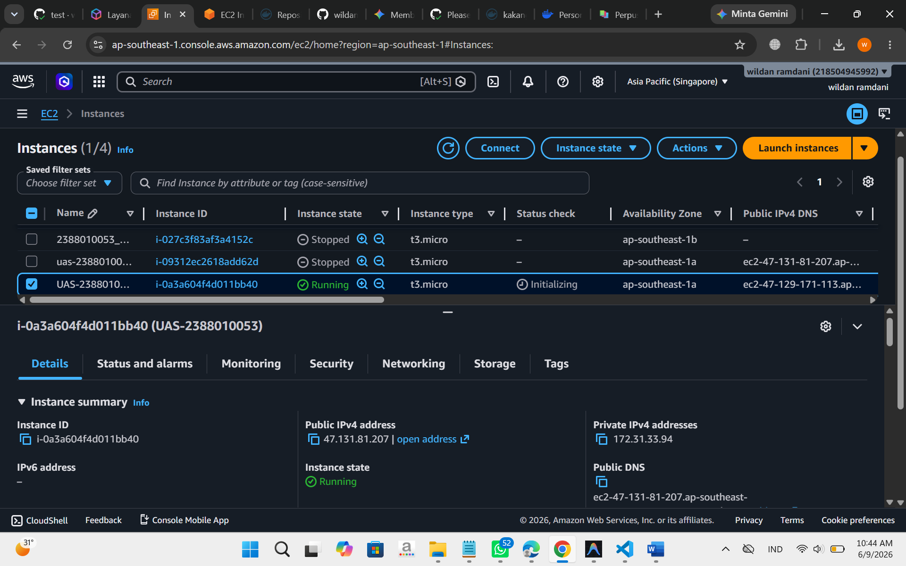
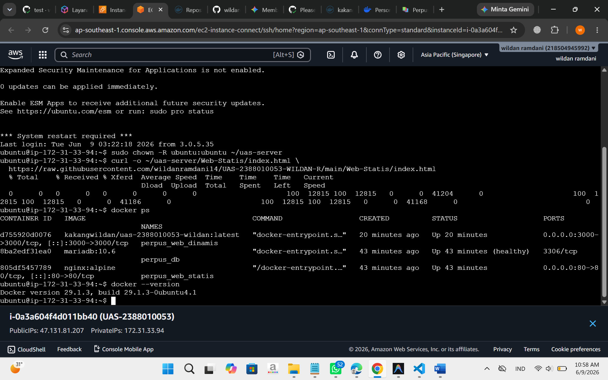
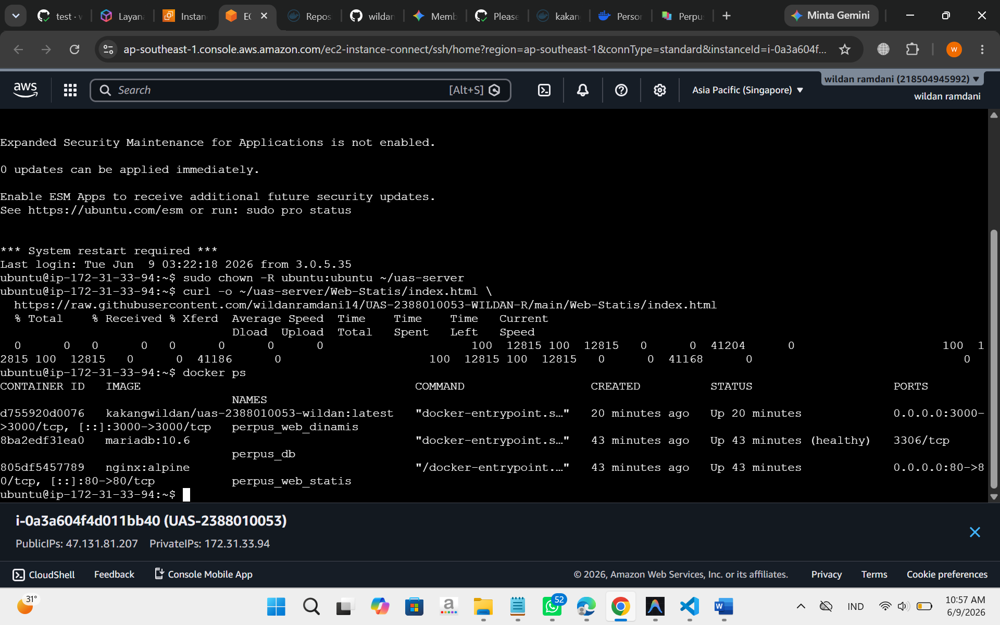
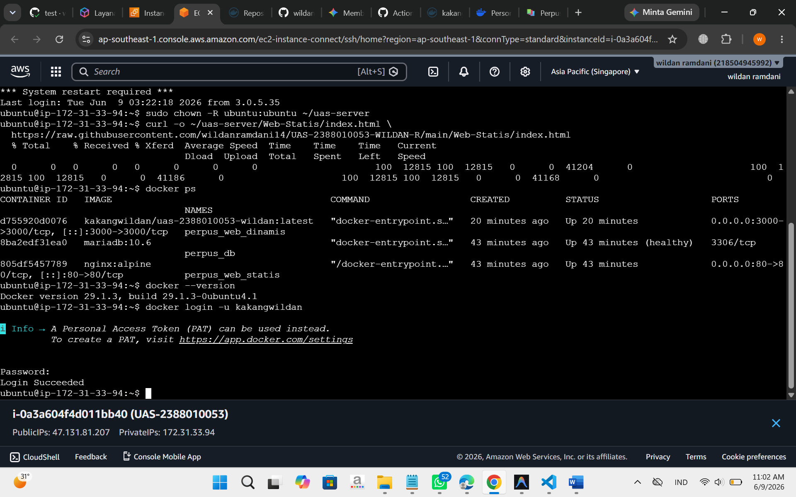
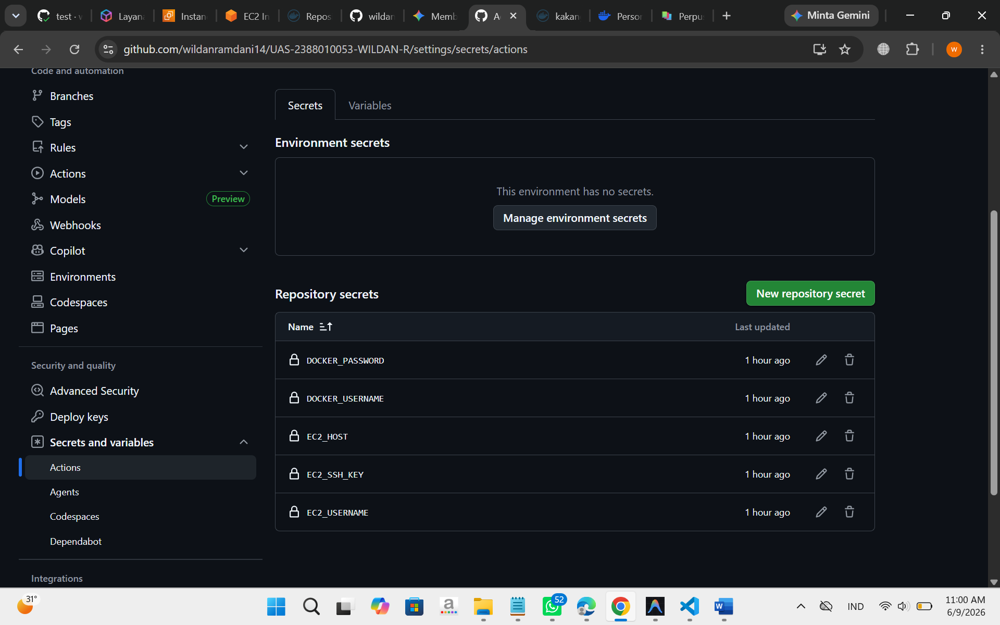
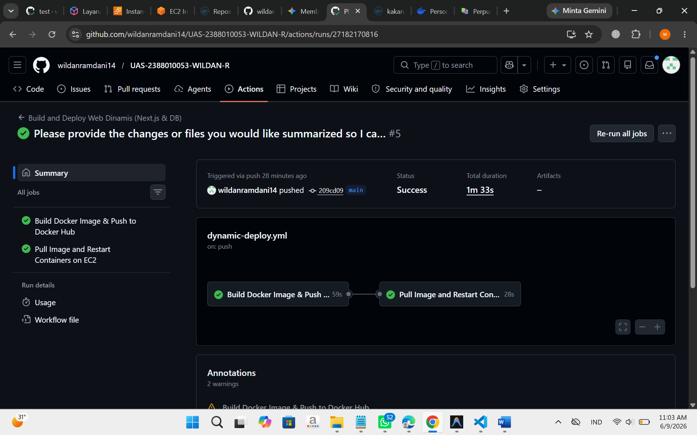
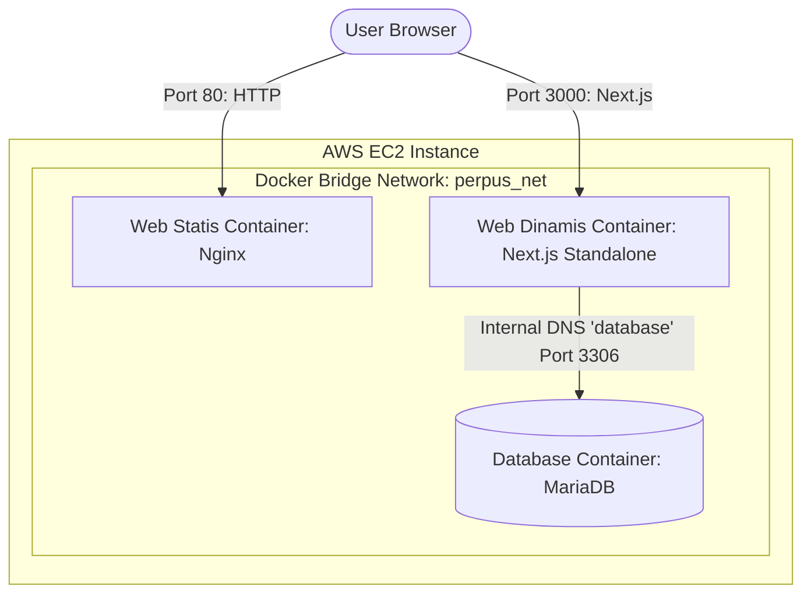

#  UAS Administrasi Server – MultiApp System Deployment
# Nama: Wildan Ramdani
# NIM : 2388010053
# MK  : Administrasi Server


Sistem ini terdiri dari dua aplikasi:
1. **Web Statis**: Website Curriculum Vitae (CV) Wildan Ramdani yang disajikan via Nginx di Port 80.
2. **Web Dinamis**: Aplikasi Manajemen Perpustakaan Digital berbasis Next.js 14 & MariaDB yang berjalan di Port 3000.

---

## Langkah-Langkah Deployment


---

## 📋 Langkah-Langkah Deployment Lengkap (Dari Awal)

Berikut adalah panduan langkah demi langkah untuk men-deploy sistem MultiApp ini di AWS EC2:

### Langkah 1: Persiapan Server AWS EC2
1. **Sewa/Jalankan EC2 Instance** dengan sistem operasi **Ubuntu 24.04 LTS** atau **Ubuntu 26.04 LTS**.
2. **Konfigurasi Security Group AWS**:
   - Tambahkan rule **Inbound** untuk membuka port berikut:
     - **Port 22** (SSH) untuk akses terminal dan deployment.
     - **Port 80** (HTTP) untuk mengakses Web Statis (CV).
     - **Port 3000** (HTTP) untuk mengakses Web Dinamis (Next.js).
     
3. **Hubungkan ke EC2 via SSH**:
   ```bash
   ssh -i "key-anda.pem" ubuntu@<IP_EC2>
   ```

### Langkah 2: Instalasi Docker & Docker Compose di EC2
Jalankan perintah berikut di terminal EC2 untuk memperbarui paket dan menginstal Docker:
```bash
# Update repository
sudo apt-get update -y

# Instal Docker dan Docker Compose Plugin
sudo apt-get install -y docker.io docker-compose-v2

# Tambahkan user ubuntu ke group docker agar bisa menjalankan docker tanpa 'sudo'
sudo usermod -aG docker ubuntu

# Terapkan perubahan group tanpa logout
newgrp docker
```


### Langkah 3: Persiapan Direktori Proyek & Izin Akses
Sebelum mendistribusikan file konfigurasi, buat folder proyek dan pastikan hak akses folder dimiliki sepenuhnya oleh user `ubuntu` (untuk menghindari error *Permission denied*):
```bash
# Buat folder kerja utama
mkdir -p ~/uas-server

# Berikan hak akses penuh kepada user ubuntu
sudo chown -R ubuntu:ubuntu ~/uas-server
```

### Langkah 4: Login Docker Hub di EC2
Lakukan login ke Docker Hub menggunakan Personal Access Token (PAT) Anda sebagai password:
```bash
docker login -u <DOCKER_USERNAME>
# Masukkan PAT Docker Hub Anda saat diminta password (contoh PAT: dckr_pat_***)
```


### Langkah 5: Konfigurasi GitHub Secrets
Pada halaman repositori GitHub Anda, masuk ke **Settings > Secrets and variables > Actions > New repository secret** dan tambahkan data berikut:
* `EC2_HOST`: IP Publik EC2 Anda (contoh: `47.131.81.207`).
* `EC2_USERNAME`: Username SSH Anda (`ubuntu`).
* `EC2_SSH_KEY`: Salin seluruh isi file `.pem` (private key) Anda.
* `DOCKER_USERNAME`: Username Docker Hub Anda (contoh: `kakangwildan`).
* `DOCKER_PASSWORD`: Personal Access Token (PAT) Docker Hub Anda.



### Langkah 6: Deployment Otomatis via Git Push (CI/CD)
1. Commit semua perubahan kode lokal Anda:
   ```bash
   git add .
   git commit -m "feat: implement dynamic app and static CV deployment"
   ```
2. Push ke branch utama untuk men-trigger alur CI/CD:
   ```bash
   git push origin main
   ```
3. GitHub Actions akan secara otomatis:
   - Mem-build image Next.js dan mempublikasikannya ke Docker Hub.
   - Menyalin file `docker-compose.yml`, `nginx.conf`, `db/init.sql`, dan aset `Web-Statis` ke EC2.
   - Menghubungkan via SSH ke EC2, melakukan pull image terbaru, dan menjalankan kontainer dengan `docker compose up -d`.

---

## 🗺️ Topologi Arsitektur & Alur Jaringan

Berikut adalah diagram arsitektur deployment menggunakan Docker Compose di AWS EC2 Instance:



---

## ⚙️ Variabel Lingkungan (Environment Variables)

Aplikasi Web Dinamis dikonfigurasi menggunakan variabel lingkungan berikut di dalam `docker-compose.yml`:

| Variabel | Deskripsi / Nilai |
| :--- | :--- |
| `DATABASE_HOST` | Hostname kontainer MariaDB (`database`). Menggunakan DNS internal Docker. |
| `DATABASE_USER` | Username untuk koneksi database (`perpustakaan_user`). |
| `DATABASE_PASSWORD`| Password untuk koneksi database (`perpustakaan_pass`). |
| `DATABASE_NAME` | Nama database utama (`perpustakaan`). |
| `NEXTAUTH_URL` | URL dasar autentikasi (diisi dengan `http://<IP_AWS>:3000`). |

> [!CAUTION]
> Port database `3306` **tidak diekspos ke publik** (no host port mapping) demi alasan keamanan infrastruktur. Hanya kontainer Next.js yang dapat mengakses database melalui jaringan internal docker (`perpus_net`).

---

## 📂 Automasi & Inisialisasi Database

Skema tabel database dan data awal (seeding) otomatis di-import saat pertama kali container dijalankan melalui folder inisialisasi MariaDB:
- File SQL lokal: `db/init.sql`
- Target mapping volume di container: `/docker-entrypoint-initdb.d/init.sql`

Secara otomatis, data pengguna dummy dan katalog buku berikut akan di-import ke MariaDB:
- **Admin**: `admin@perpus.com` (password: `admin123`)
- **User**: `budi@example.com` (password: `user123`)

---

## 🤖 Konfigurasi CI/CD Pipeline (GitHub Actions)

Repositori ini dikonfigurasi dengan teknik **Paths Filter** menggunakan dua workflow terpisah untuk menghemat resource runner dan mencegah pemborosan resource build:

### 1. Web Statis Pipeline (`.github/workflows/static-deploy.yml`)
- **Pemicu**: Modifikasi file di dalam folder `Web-Statis/**` atau file workflow ini.
- **Tugas**: Menyalin file static langsung ke direktori deployment di EC2 menggunakan SCP.

### 2. Web Dinamis Pipeline (`.github/workflows/dynamic-deploy.yml`)
- **Pemicu**: Modifikasi file di dalam folder `Web-Dinamis/**`, `db/**`, file `docker-compose.yml`, atau file workflow ini.
- **Tugas**: 
  1. Build Docker image Next.js standalone.
  2. Push image ke Docker Hub.
  3. SSH ke AWS EC2, tarik image terbaru dari Docker Hub (`docker compose pull`).
  4. Lakukan restart container (`docker compose up -d`).

### 🔑 GitHub Secrets yang Diperlukan
Untuk menjalankan pipeline ini dengan sukses, konfigurasikan Secrets berikut di repositori GitHub Anda (`Settings > Secrets and variables > Actions`):

| Nama Secret | Deskripsi |
| :--- | :--- |
| `EC2_HOST` | Alamat IP Publik AWS EC2 Anda. |
| `EC2_USERNAME` | Username SSH EC2 (contoh: `ubuntu` atau `ec2-user`). |
| `EC2_SSH_KEY` | Private Key SSH (`.pem` file content) untuk login ke EC2. |
| `DOCKER_USERNAME` | Username akun Docker Hub Anda. |
| `DOCKER_PASSWORD` | Password atau Access Token akun Docker Hub Anda. |

---

## 🚀 Panduan Menjalankan & Deployment

### Menjalankan secara Lokal dengan Docker Compose
1. Pastikan Docker Desktop telah berjalan di komputer Anda.
2. Jalankan perintah berikut di root project directory:
   ```bash
   docker compose up --build -d
   ```
3. Akses aplikasi di browser Anda:
   - Web Statis (CV): [http://localhost](http://localhost)
   - Web Dinamis (Next.js): [http://localhost:3000](http://localhost:3000)

### Uji Coba Deployment Otomatis (Zero-Touch Deployment)
1. Lakukan perubahan teks atau fitur kecil pada file lokal (misalnya mengubah teks pada CV atau Navbar perpustakaan).
2. Lakukan git commit dan push ke GitHub:
   ```bash
   git add .
   git commit -m "feat: update cv layout"
   git push origin main
   ```
3. Periksa tab **Actions** di repositori GitHub untuk melihat pipeline berjalan secara terisolasi berdasarkan path filter.
4. Setelah pipeline selesai (Centang Hijau), buka kembali halaman web di IP AWS Anda untuk melihat perubahan instan tanpa downtime!

---

## 🔗 Tautan Aplikasi (Live Test)
- **Web Statis (CV) [Port 80]**: http://47.131.81.207
- **Web Dinamis (Perpustakaan) [Port 3000]**: http://47.131.81.207:3000

---
*Dibuat oleh Wildan Ramdani untuk UAS Administrasi Server.*
